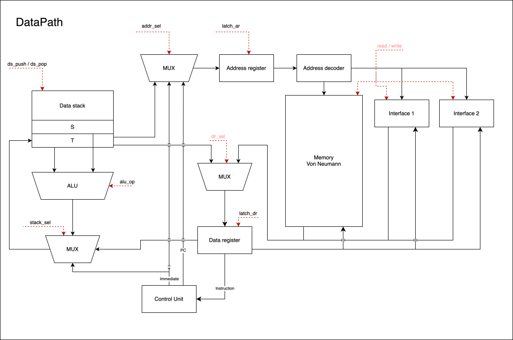
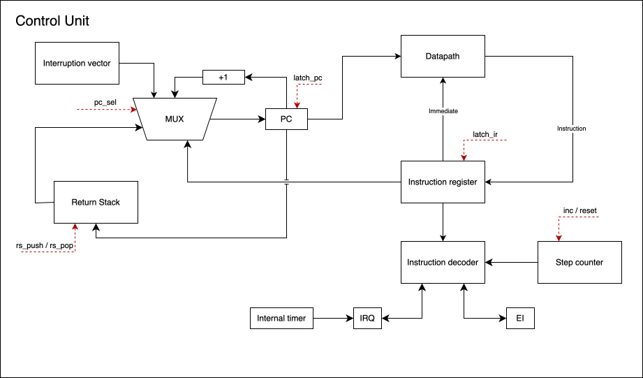

# Labwork 4. Experiment

> **ИСУ**: 467307
>
> **ФИО**: Рязанов Никита Сергеевич
>
> **Группа**: P3207
>
> **Вариант**: `alg | stack | neum | hw | tick | binary | trap | mem | cstr | prob2 | vector`

---

## Programming Language

### Assembler BNF

```bnf
<program>     ::= <line>*
<line>        ::= [<label> ":"] [<statement>] [<comment>] "\n"
<statement>   ::= <section_dir> | <org_dir> | <data_decl> | <instruction>

<section_dir> ::= ".data" | ".text"
<org_dir>     ::= ".org" <number>

<data_decl>   ::= ".word" <number> | ".str" <string>

<instruction> ::= <opcode> [<operand>]
<operand>     ::= <number> | <name>

<label>       ::= <name>
<name>        ::= { <letter> | <digit> }
<opcode>      ::= <letter>+

<number>      ::= ["-"] ( <decimal> | <hex> | <octal> | <binary> )
<decimal>     ::= <digit>+
<hex>         ::= "0x" <hex_digit>+
<octal>       ::= "0o" <oct_digit>+
<binary>      ::= "0b" <bin_digit>+

<letter>      ::= [a-zA-Z_]
<digit>       ::= [0-9]
<hex_digit>   ::= [0-9a-fA-F]
<oct_digit>   ::= [0-7]
<bin_digit>   ::= [01]

<string>      ::= <any character except '"'>*
<comment>     ::= ";" <any character except '\n'>*
```

### Semantics

**Evaluation strategy** - strictly sequential (imperative). Each instruction completes before the next one begins. Execution order is driven by the program counter `PC`. Control-flow instructions (e.g., `JUMP`, `BEQZ`, `BNEZ`, `BVS`, `CALL`) update `PC`.

**Scoping** - global. Labels are visible throughout the whole file.

**Typing** - none. All values are 32-bit signed integers. Characters are stored as `ord(char)`.

**Literals:**

- Numbers: decimal, hexadecimal (`0x…`), octal (`0o…`), binary (`0b…`). A literal may appear directly in an instruction operand (24-bit signed range: −8,388,608 … +8,388,607). Values outside this range must be placed in the data section with the `.word` directive.

- Strings: stored only in data section via `.str` in C style. One machine word per character (`ord(c)`), terminated by a zero word (`\0`). Length is not stored, traversal stops at the zero word.

**Variables** - declared with `.word` in data section. Each occupies one 32-bit machine word.

**Procedures** - invoked with `CALL addr`. The return address is saved on the Return Stack. Finished with `RET`.

**Interrupts** - the interrupt vector is stored at address `0x0`. On interrupt, `PC` is pushed to the Return Stack and the `EI` flag is cleared. Handling of interruption ends with `IRET` which restores `PC` and `EI`.

**Example program:**

```asm
.data
message: .str "Hello, World!"
ptr: .word 0

.text
_start:
    push message
    popm ptr
loop:
    pushm ptr
    pushi
    beqz end
    push 2046
    pushm ptr
    pushi
    popi
    pushm ptr
    push 1
    add
    popm ptr
    jump loop
end:
    halt
```

---

## Memory Organization

### Memory Model

Von Neumann architecture - a single address space for instructions and data.

```mem
     Address     Description
  +-----------+----------------------------------+
  | 0x0       | interrupt vector (optional)      | 
  | ...       |                                  |
  | D         | start of .data                   | 
  | ...       | variables                        |
  | T         | start of .text                   | 
  | ...       | _start: instructions             |
  | 2045      | MMIO: INPUT                      | 
  | 2046      | MMIO: OUTPUT_SYMB                | 
  | 2047      | MMIO: OUTPUT_DEC                 |
  +-----------+----------------------------------+
```

**Size:** 2048 machine words of 32 bits each (2045 of which available for code and data).

**Stacks:**

- `Data Stack` - operand stack (depth up to 256). All computation goes through it.

- `Return Stack` - return-address stack (depth up to 256); holds return addresses for `CALL` / `RET` / `IRET`. Not manipulated directly by the programmer.

**Addressing modes:**

| Mode        | Example             | Description                                      |
|-------------|---------------------|--------------------------------------------------|
| Immediate   | `PUSH <immediate>`  | Load constant from the instruction operand       |
| Direct      | `PUSHM <address>`   | Read from memory by address in the operand       |
| Indirect    | `PUSHI`             | Read from memory by address on the stack top     |

**Mapping to memory:**

- `.word N` - one word initialized with N.

- `.str "str"` → `len(str) + 1` words: one word per character, last word is the null terminator.

- Instructions - one 32-bit word (8-bit opcode + 24-bit operand).

- Fixed address `0x0` that should contain `JUMP` to the interrupt handler.

---

## Instruction Set

### Processor Features

- **Architecture:** stack (`stack`). No general-purpose registers - all computation uses the `Data Stack`. The Return Stack is managed by hardware for `CALL` / `RET` / `IRET`.

- **I/O:** memory-mapped I/O (cell addresses 2045–2047). Access via `PUSHM` / `PUSHI` / `POPM` / `POPI`.

- **Interrupts:** a single `input_port` cell holds the incoming character. Each **tick**, the interrupt schedule (`trap_schedule`) is checked: if the scheduled tick has arrived and the **port is empty**, the character is written to `input_port` and `irq` is set. If the port is busy, the new character is **dropped**. The handler runs **between instructions**: before fetch, `irq && ei` is tested - if true, `PC` is pushed to the Return Stack, `PC ← 0x0`, `ei ← 0` and `irq ← 0`. `IRET` restores `PC` and sets `ei ← 1`. `input_port` is cleared when read at `INPUT_ADDR`.

- **Nested interrupts** are not allowed (`ei = 0`). If a character arrives while `ei = 0` but the port is already empty (the handler has read it), the character is placed in `input_port` and `irq` is set. After `IRET`, it will be serviced again because interrupts are re-enabled. If the port is still busy, the character is lost.

- **Flags:**
  - `carry` (C) - unsigned carry:
    - ADD: set if the result does not fit in 32 bits
    - SUB: set if the minuend is less than the subtrahend (unsigned)
    - ADDC, SUBC: same rules, also accounting for the previous carry on input
  - `overflow` (V) - signed overflow:
    - ADD, ADDC: set if both operands have the same sign and the result has the opposite sign
    - SUB, SUBC: set if operands have opposite signs and the result does not match the minuend's sign
    - DIV: set when dividing INT_MIN by −1

  ADD, SUB, ADDC, and SUBC update both flags. Bitwise instructions (`NOT`, `AND`, `OR`) and branches do not modify flags.

### Instruction Encoding

Each instruction is one 32-bit machine word:

```inst
 31      24 23                   0
+----------+----------------------+
|  opcode  |       operand        |
| (8 bits) |      (24 bits)       |
+----------+----------------------+
```

The operand is sign-extended to 32 bits when decoded.

### Instruction Set Summary

Full instruction cycle = 3 fetch cycles + n execute cycles.

| Mnemonic   | Opcode | Operand     | Operation                                    | Execute cycles |
|------------|--------|-------------|----------------------------------------------|----------------|
| `PUSH`     | 0x01   | `immediate` | `DS.push(imm)`                               | 1              |
| `PUSHM`    | 0x02   | `address`   | `DS.push(MEM[addr])`                         | 3              |
| `PUSHI`    | 0x03   | -           | `DS.push(MEM[DS.pop()])`                     | 3              |
| `POP`      | 0x04   | -           | `DS.pop()`                                   | 1              |
| `POPM`     | 0x05   | `address`   | `MEM[addr] = DS.pop()`                       | 2              |
| `POPI`     | 0x06   | -           | `val=DS.pop(); addr=DS.pop(); MEM[addr]=val` | 3              |
| `DUP`      | 0x07   | -           | `DS.push(DS[-1])`                            | 2              |
| `ADD`      | 0x09   | -           | `DS.push(DS.pop() + DS.pop())` ; C, V        | 1              |
| `SUB`      | 0x0A   | -           | `DS.push(DS.pop() − DS.pop())` ; C, V        | 1              |
| `MUL`      | 0x0B   | -           | `DS.push((DS.pop() * DS.pop()) & 0xFFFFFFFF)`| 1              |
| `MULH`     | 0x0C   | -           | `DS.push((DS.pop() * DS.pop()) >> 32)`       | 1              |
| `ADDC`     | 0x0D   | -           | `DS.push(DS.pop() + DS.pop() + C)` ; C, V    | 1              |
| `SUBC`     | 0x0E   | -           | `DS.push(DS.pop() − DS.pop() − C)` ; C, V    | 1              |
| `DIV`      | 0x0F   | -           | `DS.push(DS.pop() / DS.pop())`               | 1              |
| `MOD`      | 0x10   | -           | `DS.push(DS.pop() % DS.pop())`               | 1              |
| `CMP`      | 0x11   | -           | `DS.push(DS.pop() == DS.pop() ? 1 : 0)`      | 1              |
| `GT`       | 0x12   | -           | `DS.push(DS.pop() > DS.pop() ? 1 : 0)`       | 1              |
| `LT`       | 0x13   | -           | `DS.push(DS.pop() < DS.pop() ? 1 : 0)`       | 1              |
| `NOT`      | 0x14   | -           | `DS.push(~DS.pop())`                         | 1              |
| `AND`      | 0x15   | -           | `DS.push(DS.pop() & DS.pop())`               | 1              |
| `OR`       | 0x16   | -           | `DS.push(DS.pop() \| DS.pop())`              | 1              |
| `JUMP`     | 0x17   | `address`   | `PC = addr`                                  | 1              |
| `BEQZ`     | 0x18   | `address`   | `if DS.pop() == 0: PC = addr`                | 1              |
| `BNEZ`     | 0x19   | `address`   | `if DS.pop() != 0: PC = addr`                | 1              |
| `BVS`      | 0x1A   | `address`   | `if V: PC = addr`                            | 1              |
| `BVC`      | 0x1B   | `address`   | `if !V: PC = addr`                           | 1              |
| `BCS`      | 0x1C   | `address`   | `if C: PC = addr`                            | 1              |
| `BCC`      | 0x1D   | `address`   | `if !C: PC = addr`                           | 1              |
| `CALL`     | 0x1E   | `address`   | `RS.push(PC); PC = addr`                     | 1              |
| `RET`      | 0x1F   | -           | `PC = RS.pop()`                              | 1              |
| `IRET`     | 0x20   | -           | `PC = RS.pop(); EI = 1`                      | 1              |
| `HALT`     | 0x21   | -           | Halt                                         | 1              |

**Example for `PUSHM <address>`:**

1. operand → MUX → AR (`addr_sel = imm`, `latch_ar`)

2. MEM[AR] → MUX → DR (`read`, `dr_sel = mem`, `latch_dr`)

3. DR → MUX → T (DS) (`stack_sel = DR`, `ds_push`)

---

## Translator

### Command-Line Interface

```sh
python3 src/translator.py <source.asm> <output.bin>
```

Produces two files:

- `<output.bin>` - binary file. First 4 bytes: start address (`_start`), followed by 2048 × 4 bytes of memory.

- `<output>_dump.log` - text dump in the form `<addr> - <HEXCODE> - <mnemonic>`.

Example:

```sh
python3 src/translator.py examples/hello_world.asm out/hello.bin
```

Example dump:

```text
START: 0001

0000 - 17000002 - JUMP 2
0001 - 17000001 - JUMP 1
0002 - 020007FD - PUSHM 2045
0003 - 07000000 - DUP
0004 - 01000000 - PUSH 0
0005 - 11000000 - CMP
0006 - 18000008 - BEQZ 8
0007 - 21000000 - HALT
0008 - 050007FE - POPM 2046
0009 - 20000000 - IRET
0010-2047 - 00000000 - 0
```

### Translation Stages

```text
Source code (.asm)
      |
      V
First pass: layout
Parse .data / .text / .org, assign label addresses,
write data (.word, .str) into the memory array,
collect instructions with their addresses (mnemonic + operand)
      |
      V
Second pass: encoding
Resolve label addresses in operands,
encode each instruction as a 32-bit word,
write into the memory array
      |
      V
Write .bin and _dump.log
```

**Translator limitations:**

- Operands: labels or numeric literals only (no expressions).

- No type or operand-range checking.

---

## Processor Model

### DataPath



**Signals from Control Unit:**

| Signal      | Description                                                              |
|-------------|--------------------------------------------------------------------------|
| `ds_push`   | Push MUX output onto the Data Stack                                      |
| `ds_pop`    | Pop T from the Data Stack                                                |
| `addr_sel`  | MUX selector for the value loaded into AR                                |
| `latch_ar`  | Latch Address Register from MUX                                          |
| `dr_sel`    | MUX selector for the value loaded into DR                                |
| `latch_dr`  | Latch Data Register                                                      |
| `alu_op`    | ALU operation code                                                       |
| `stack_sel` | MUX selector for the value pushed onto T (Data Stack)                    |
| `read`      | Initiate read: selected device (memory or I/O) drives the bus            |
| `write`     | Initiate write: selected device (memory or I/O) accepts data from the bus|

### ControlUnit



**Signals from Control Unit:**

| Signal     | Description                              |
|------------|------------------------------------------|
| `pc_sel`   | MUX selector for the value loaded into PC|
| `latch_pc` | Latch PC                                 |
| `rs_push`  | Push PC onto the Return Stack            |
| `rs_pop`   | Pop from the Return Stack                |
| `latch_ir` | Latch IR                                 |
| `inc`      | Increment Step Counter by 1              |
| `reset`    | Reset Step Counter to 0                  |

#### Fetch Cycle

The instruction fetch cycle is the same for all instructions and takes 3 cycles:

1. `PC → MUX → AR` (`latch_ar`)
2. `MEM[AR] → DR` (`latch_dr`)
3. `DR → IR` (`latch_ir`), concurrently with `PC + 1 → PC` (`latch_pc`)

After fetch, the execute phase runs.
Between instructions, `irq && ei` is checked. If true, **one additional cycle** runs: push PC to the Return Stack, `PC ← 0x0`, `ei ← 0`, `irq ← 0`.

### Simulator Implementation Notes

- **Cycle-accurate.** Fetch always takes **3 cycles**. Execute takes 1–3 cycles depending on the opcode.
- Main loop: `check_interrupt() → fetch() → execute_instruction()`. After each cycle, `tick()` advances the global tick counter and checks the interrupt schedule.
- Two hardware stacks: `data_stack` and `return_stack`. Overflow raises an exception and stops the machine.
- MMIO: access type is determined by address. `memory_read(2045)` returns the current `input_port` value and clears the port. `memory_write(2046, v)` appends ASCII to `output_buffer`. `memory_write(2047, v)` appends a decimal value to `output_buffer`.

---

## Testing

### Toolchain

```text
<name>.asm
       |  python3 src/translator.py <name.asm> <output.bin>
       V
<name>.bin + <name>_dump.log
       |  python3 src/machine.py <binary.bin> [input.txt]
       V
stdout: tick log + output
```

**Example:**

```sh
python3 src/translator.py examples/hello_world.asm out/hello.bin

python3 src/machine.py out/hello.bin
Tick: 0003 | pc: 0010 | DS: [] | EI: 1 | carry: False | Instr: PUSH 0
Tick: 0007 | pc: 0011 | DS: [0] | EI: 1 | carry: False | Instr: POPM 14
 ...
Output: Hello, World!
Overall quantity of ticks: 809
Instructions executed: 162
```

In the log, `Tick` marks the start of the execute phase of the current instruction (after the 3-cycle fetch). Lines like `[ISR] Tick: ...` mean execution inside the interrupt handler (`ei = 0`). Input delivery and loss are logged separately: `TRAP DELIVERED 'H' (0x48) -> input_port`, `TRAP 'l' DROPPED (port busy)`.

### Golden Tests

Tests are contained in `tests` folder. Run:

```sh
pytest -v                         # normal run
pytest tests/ --update-goldens    # regenerate snapshots
```

| Test          | Algorithm                                                                 |
|---------------|---------------------------------------------------------------------------|
| `hello_world` | Print hello world                                                         |
| `cat`         | Echo input characters to output                                           |
| `hello_user`  | Prompt for a name, read it, print a greeting                              |
| `sort`        | Bubble sort of an array                                                   |
| `double_math` | 64-bit arithmetic                                                         |
| `prob2`       | Euler #6: difference of square of sum and sum of squares for 1..100       |
| `array_sum`   | Sum array elements with step-by-step intermediate output                  |
| `cat_fail`    | Character loss under a dense interrupt schedule                           |

**Golden file layout:**

```text
tests/golden/<name>.yml
    in_source - algorithm source code
    output - program output without the tick log
    machine_code - machine code and data dump
    out_log - tick log
    in_stdin - input data
```
