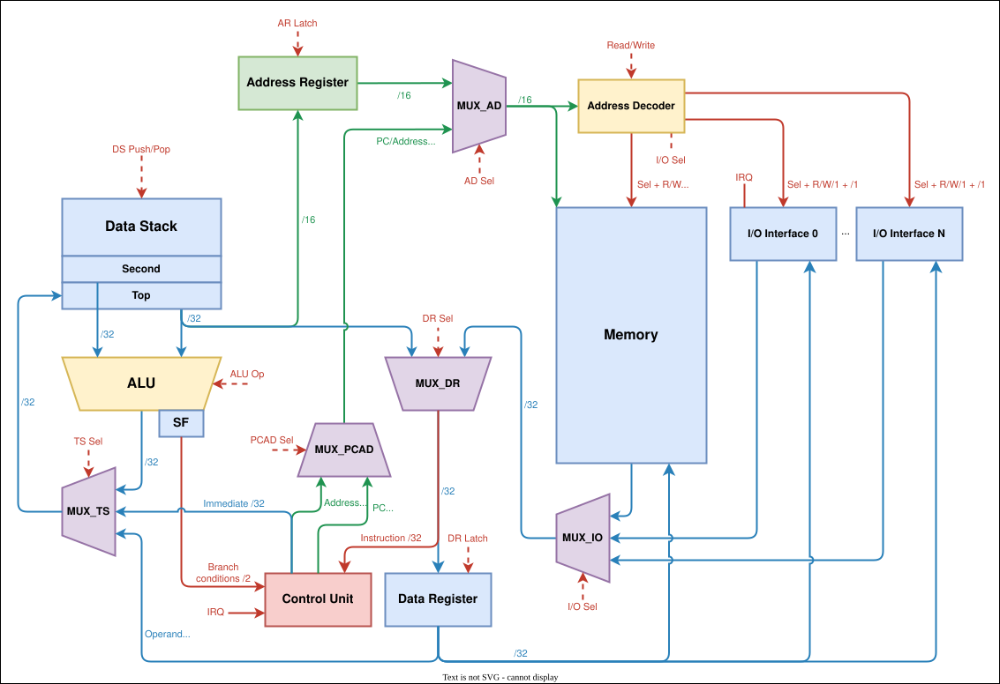
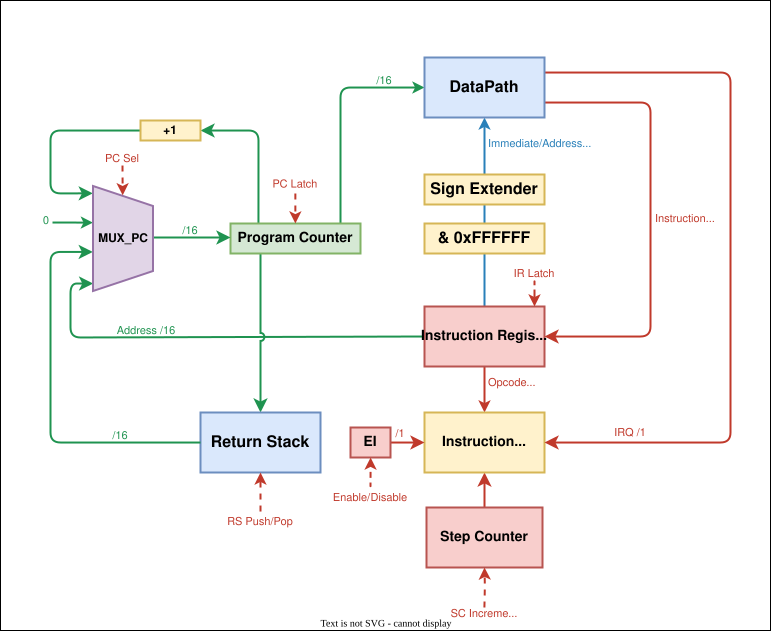

# Labwork 4. Experiment

> **ИСУ**: 467307
>
> **ФИО**: Рязанов Никита Сергеевич
>
> **Группа**: P3207
>
> **Вариант**: `alg | stack | neum | hw | tick | binary | trap | mem | cstr | prob2 | vector`

---

## Programming Language

A small JavaScript-like programming language. It is compiled to the assembler described further below, so the toolchain
is `alg -> asm -> binary -> machine`.

### Algorithmic Language BNF

```bnf
<program>     ::= { <func_def> | <interrupt> | <statement> }

<func_def>    ::= "func" <name> "(" ")" <block>
<interrupt>   ::= "interrupt" <block>
<block>       ::= "{" { <statement> } "}"

<statement>   ::= <let> | <assign> | <index_assign> | <if> | <while> | <return> | <expr_stmt>
<let>         ::= "let" <name> "=" ( <expr> | <array_lit> ) ";"
<assign>      ::= <name> "=" <expr> ";"
<index_assign>::= <name> "[" <expr> "]" "=" <expr> ";"
<if>          ::= "if" "(" <expr> ")" <block> [ "else" ( <if> | <block> ) ]
<while>       ::= "while" "(" <expr> ")" <block>
<return>      ::= "return" [ <expr> ] ";"
<expr_stmt>   ::= <expr> ";"

<array_lit>   ::= "[" [ <number> { "," <number> } ] "]"

<expr>        ::= <comparison>
<comparison>  ::= <additive> { ("==" | "!=" | "<" | ">" | "<=" | ">=") <additive> }
<additive>    ::= <term> { ("+" | "-") <term> }
<term>        ::= <unary> { ("*" | "/" | "%") <unary> }
<unary>       ::= "-" <unary> | <primary>
<primary>     ::= <number> | <string> | <name> | <index> | <call> | "(" <expr> ")"
<index>       ::= <name> "[" <expr> "]"
<call>        ::= <name> "(" [ <expr> { "," <expr> } ] ")"

<name>        ::= <letter> { <letter> | <digit> }
<number>      ::= <decimal> | <hex> | <octal> | <binary>
<string>      ::= '"' { <char> | <escape> } '"'
<escape>      ::= "\n" | "\t" | "\r" | "\0" | "\\" | "\""
<comment>     ::= "//" { <any char except newline> }
```

### Algorithmic Language Semantics

**Evaluation strategy** - strictly sequential / imperative. Statements run top to bottom;
`if`/`while` drive control flow. Every expression is evaluated on the data stack, leaving
exactly one value on top.

**Scoping** - global. Every `let` (anywhere in the program) allocates one global variable
(`.word`); functions share these globals and take no parameters.

**Typing** - none. All values are 32-bit signed integers. A character literal is its code
point; comparison operators yield `1` (true) or `0` (false).

**Literals** - integers (`decimal`, `0x…`, `0o…`, `0b…`) and string literals. 
String literals are stored as C-strings (`.str`).

**Arrays** - `let a = [v0, v1, …];` declares an array of integers laid out in the data section. 
`a[i]` reads and `a[i] = e` writes an element
(compiled to base-address arithmetic plus the indirect `PUSHI`/`POPI` instructions). The
bare name `a` evaluates to the base address, and `len(a)` is the compile-time length.

**Interrupts** - an `interrupt { … }` block becomes the handler, whose address is stored at the vector
`0x0`. `input()` reads one character from the input port (MMIO 65533). The handler ends
with an implicit `IRET`.

**Built-ins:**

| Built-in                                 | Effect                                                                                              |
|------------------------------------------|-----------------------------------------------------------------------------------------------------|
| `print(e)`                               | Print a number as decimal, or a string literal as text (65535 / `__print_str`)                      |
| `putc(e)`                                | Write one character (65534)                                                                         |
| `input()`                                | Read one character from the input port (65533)                                                      |
| `len(a)`                                 | Compile-time length of array `a`                                                                    |
| `halt()`                                 | Stop the machine                                                                                    |
| `addc(a, b)`, `subc(a, b)`, `mulh(a, b)` | Carry-aware add / subtract, and high word of a product - used for 64-bit arithmetic (`double_math`) |

<!-- 
**Mapping expressions onto the machine.** The target is a stack machine with no
general-purpose registers, so the data stack *is* the expression-evaluation scratch space:

- A leaf (`Num`/`Var`) pushes one value (`push imm` / `pushm var`).
- A `BinOp` emits *left, right, op*; the ALU pops the two operands and pushes the result,
  so a nested expression like `sum * sum - sqsum` naturally becomes a post-order traversal
  of the AST onto the stack. Operator precedence is encoded by the grammar, so no register
  allocation or temporaries in memory are ever needed.
- Comparisons that have no direct opcode are synthesized: `a != b` -> `cmp; push 0; cmp`,
  `a <= b` -> `gt; push 0; cmp`, `a >= b` -> `lt; push 0; cmp`.
- Variables live in the static data section; there is no spilling because intermediate
  results stay on the stack. 
-->

**Example program:**

```alg
let n = 100;
let i = 1;
let sum = 0;
while (i <= n) {
    sum = sum + i;
    i = i + 1;
}
print(sum);
putc(10);
```

### Assembler Language BNF

```bnf
<program>     ::= <line>*
<line>        ::= [<label> ":"] [<statement>] [<comment>] "\n"
<statement>   ::= <section_dir> | <org_dir> | <data_decl> | <instruction>

<section_dir> ::= ".data" | ".text"
<org_dir>     ::= ".org" <number>

<data_decl>   ::= ".word" <number> | ".str" <string>

<instruction> ::= <opcode> [<operand>]
<operand>     ::= <number> | <name>

<label>       ::= <name>
<name>        ::= { <letter> | <digit> }
<opcode>      ::= <letter>+

<number>      ::= ["-"] ( <decimal> | <hex> | <octal> | <binary> )
<decimal>     ::= <digit>+
<hex>         ::= "0x" <hex_digit>+
<octal>       ::= "0o" <oct_digit>+
<binary>      ::= "0b" <bin_digit>+

<letter>      ::= [a-zA-Z_]
<digit>       ::= [0-9]
<hex_digit>   ::= [0-9a-fA-F]
<oct_digit>   ::= [0-7]
<bin_digit>   ::= [01]

<string>      ::= <any character except '"'>*
<comment>     ::= ";" <any character except '\n'>*
```

### Assembler Language Semantics

**Evaluation strategy** - strictly sequential / imperative. Each instruction completes before the next one begins. Execution order is driven by the program counter `PC`. Control-flow instructions (e.g., `JUMP`, `BEQZ`, `BNEZ`, `BVS`, `CALL`) update `PC`.

**Scoping** - global. Labels are visible throughout the whole file.

**Typing** - none. All values are 32-bit signed integers. Characters are stored as their code value.

**Literals:**

- Numbers: decimal, hexadecimal (`0x…`), octal (`0o…`), binary (`0b…`). A literal may appear directly in an instruction operand (24-bit signed range: [−8_388_608; +8_388_607]). Values outside this range must be placed in the data section with the `.word` directive.

- Strings: stored only in data section via `.str` in C style. One machine word per character, terminated by a zero word (`\0`). Length is not stored, traversal stops at the zero word.

**Variables** - declared with `.word` in data section. Each occupies one 32-bit machine word.

**Procedures** - invoked with `CALL`. The return address is saved on the Return Stack. Finished with `RET`.

**Interrupts** - the interrupt vector is stored at address `0x0`. On interrupt, `PC` is pushed to the Return Stack and the `EI` flag is cleared. Handling of interruption ends with `IRET` which restores `PC` and `EI`.

**Example program:**

```asm
.data
message: .str "Hello, World!"
ptr: .word 0

.text
_start:
    push message
    popm ptr
loop:
    pushm ptr
    pushi
    beqz end
    push 65534
    pushm ptr
    pushi
    popi
    pushm ptr
    push 1
    add
    popm ptr
    jump loop
end:
    halt
```

---

## Memory Organization

### Memory Model

Von Neumann architecture - a single address space for instructions and data.

```mem
     Address     Description
  +-----------+----------------------------------+
  | 0x0       | interrupt vector (optional)      | 
  | ...       |                                  |
  | D         | start of .data                   | 
  | ...       | variables                        |
  | T         | start of .text                   | 
  | ...       | _start: instructions             |
  | 65533     | MMIO: INPUT                      | 
  | 65534     | MMIO: OUTPUT_SYMB                | 
  | 65535     | MMIO: OUTPUT_DEC                 |
  +-----------+----------------------------------+
```

**Size:** 65536 machine words of 32 bits each.

**Stacks:**

- `Data Stack` - operand stack. All computation goes through it.

- `Return Stack` - return-address stack. Holds return addresses for `CALL` / `RET` / `IRET`. Not manipulated directly by the programmer.

**Addressing modes:**

| Mode      | Example            | Description                                  |
|-----------|--------------------|----------------------------------------------|
| Immediate | `PUSH <immediate>` | Load constant from the instruction operand   |
| Direct    | `PUSHM <address>`  | Read from memory by address in the operand   |
| Indirect  | `PUSHI`            | Read from memory by address on the stack top |

**Mapping to memory:**

- `.word N` - one word initialized with value N.

- `.str "str"` -> `len(str) + 1` words: one word per character, last word is the null terminator.

- Instructions - one 32-bit word (8-bit opcode + 24-bit operand).

- Fixed address `0x0` that should contain `JUMP` to the interrupt handler.

---

## Instruction Set Architecture

### Processor Features

- **Architecture:** stack. No general-purpose registers - all computation uses the `Data Stack`. The `Return Stack` is managed by hardware for `CALL` / `RET` / `IRET`.

- **I/O:** memory-mapped I/O (addresses 65533–65535). Access via `PUSHM` / `PUSHI` / `POPM` / `POPI`.

- **Interrupts:** each **tick**, the interrupt schedule is checked: if the scheduled tick has arrived and the **port is empty**, the character is written to `input_port` and `IRQ` is set. If the port is busy, the new character is **dropped**. The handler runs **between instructions**: before fetch, `IRQ && EI` is tested - if true, `PC` is pushed to the Return Stack, `PC <- 0x0`, `EI <- 0` and `IRQ <- 0`. `IRET` restores `PC` and sets `EI <- 1`. `input_port` is cleared when read at `INPUT_ADDR`.

- **Nested interrupts** are not allowed (`EI = 0`). If a character arrives while `EI = 0` but the port is already empty (the handler has read it), the character is placed in `input_port` and `IRQ` is set. After `IRET`, it will be serviced again because interrupts are re-enabled. If the port is still busy, the character is lost.

- **Flags:**
  - `carry` (C) - unsigned carry:
    - ADD: set if the result does not fit in 32 bits
    - SUB: set if the minuend is less than the subtrahend (unsigned)
    - ADDC, SUBC: same rules, also accounting for the previous carry on input
  - `overflow` (V) - signed overflow:
    - ADD, ADDC: set if both operands have the same sign and the result has the opposite sign
    - SUB, SUBC: set if operands have opposite signs and the result does not match the minuend's sign

  ADD, SUB, ADDC, and SUBC update both flags. Bitwise instructions (`NOT`, `AND`, `OR`) and branches do not modify flags.

### Instruction Encoding

Each instruction is one 32-bit machine word:

```inst
31       24 23                    0
+----------+----------------------+
|  opcode  |       operand        |
| (8 bits) |      (24 bits)       |
+----------+----------------------+
```

The operand is sign-extended to 32 bits when decoded.

### Instruction Set

Full instruction cycle = 1 fetch cycle + n execute cycles.

Immediate operand takes up to 24 bits, address - up to 16 bits.

| Mnemonic | Opcode | Operand     | Operation                                     | Execute cycles |
|----------|--------|-------------|-----------------------------------------------|----------------|
| `PUSH`   | 0x01   | `immediate` | `DS.push(imm)`                                | 1              |
| `PUSHM`  | 0x02   | `address`   | `DS.push(MEM[addr])`                          | 2              |
| `PUSHI`  | 0x03   | -           | `DS.push(MEM[DS.pop()])`                      | 3              |
| `POP`    | 0x04   | -           | `DS.pop()`                                    | 1              |
| `POPM`   | 0x05   | `address`   | `MEM[addr] = DS.pop()`                        | 2              |
| `POPI`   | 0x06   | -           | `val=DS.pop(); addr=DS.pop(); MEM[addr]=val`  | 3              |
| `DUP`    | 0x07   | -           | `DS.push(DS[-1])`                             | 2              |
| `ADD`    | 0x09   | -           | `DS.push(DS.pop() + DS.pop())` ; C, V         | 1              |
| `SUB`    | 0x0A   | -           | `DS.push(DS.pop() − DS.pop())` ; C, V         | 1              |
| `MUL`    | 0x0B   | -           | `DS.push((DS.pop() * DS.pop()) & 0xFFFFFFFF)` | 1              |
| `MULH`   | 0x0C   | -           | `DS.push((DS.pop() * DS.pop()) >> 32)`        | 1              |
| `ADDC`   | 0x0D   | -           | `DS.push(DS.pop() + DS.pop() + C)` ; C, V     | 1              |
| `SUBC`   | 0x0E   | -           | `DS.push(DS.pop() − DS.pop() − C)` ; C, V     | 1              |
| `DIV`    | 0x0F   | -           | `DS.push(DS.pop() / DS.pop())`                | 1              |
| `MOD`    | 0x10   | -           | `DS.push(rem(DS.pop(), DS.pop()))`            | 1              |
| `CMP`    | 0x11   | -           | `DS.push(DS.pop() == DS.pop() ? 1 : 0)`       | 1              |
| `GT`     | 0x12   | -           | `DS.push(DS.pop() > DS.pop() ? 1 : 0)`        | 1              |
| `LT`     | 0x13   | -           | `DS.push(DS.pop() < DS.pop() ? 1 : 0)`        | 1              |
| `NOT`    | 0x14   | -           | `DS.push(~DS.pop())`                          | 1              |
| `AND`    | 0x15   | -           | `DS.push(DS.pop() & DS.pop())`                | 1              |
| `OR`     | 0x16   | -           | `DS.push(DS.pop() \| DS.pop())`               | 1              |
| `JUMP`   | 0x17   | `address`   | `PC = addr`                                   | 1              |
| `BEQZ`   | 0x18   | `address`   | `if DS.pop() == 0: PC = addr`                 | 1              |
| `BNEZ`   | 0x19   | `address`   | `if DS.pop() != 0: PC = addr`                 | 1              |
| `BVS`    | 0x1A   | `address`   | `if V: PC = addr`                             | 1              |
| `BVC`    | 0x1B   | `address`   | `if !V: PC = addr`                            | 1              |
| `BCS`    | 0x1C   | `address`   | `if C: PC = addr`                             | 1              |
| `BCC`    | 0x1D   | `address`   | `if !C: PC = addr`                            | 1              |
| `CALL`   | 0x1E   | `address`   | `RS.push(PC); PC = addr`                      | 1              |
| `RET`    | 0x1F   | -           | `PC = RS.pop()`                               | 1              |
| `IRET`   | 0x20   | -           | `PC = RS.pop(); EI = 1`                       | 1              |
| `HALT`   | 0x21   | -           | Halt                                          | 1              |
---

## Translator

The toolchain has two translators. There is a single entry point that
produces a binary: it assembles `.asm` directly, and for `.alg` input it first invokes the
`alg` to translate it into `asm`.

### Unified CLI

```sh
python src\translator.py <source.asm | source.alg> <output.bin> [--lang asm|alg]
```

The source language is inferred from the file extension (`.alg` -> `alg`, otherwise `asm`);
`--lang` overrides it:

```sh
python src\translator.py example\alg\prob2.alg out\prob2.bin
python src\machine.py out\prob2.bin
```

### Algorithmic CLI

It is possible to compile `alg` to assembler text on its own (useful for inspecting the output
or the AST):

```sh
python src\alg.py <source.alg> <output.asm> [--ast]
```

- *Input*: an `.alg` source file. *Output*: the generated `.asm`.
- `--ast` additionally prints the human-readable AST to stdout.

It runs three stages: **tokenize** (regex lexer) -> **parse** (recursive-descent parser
building the AST shown in the golden tests) -> **generate** (walk through AST and
generate appropriate stack-machine instructions).

### Assembler CLI

Almost the same works with `.asm` input that produces two files:

- `<output.bin>` - binary file. First 4 bytes: start address (`_start`), followed by the memory image as big-endian 32-bit words. Trailing zero words are omitted.
  
- `<output>.dump` - text dump in the form `<addr> - <HEXCODE> - <mnemonic>`.

Example:

```sh
python src\asm.py example\asm\hello_world.asm out\hello_world.bin
```

Example dump:

```text
START: 0015

0000 - 00000048 - DATA (72)
0001 - 00000065 - DATA (101)
0002 - 0000006C - DATA (108)
0003 - 0000006C - DATA (108)
0004 - 0000006F - DATA (111)
0005 - 0000002C - DATA (44)
0006 - 00000020 - DATA (32)
0007 - 00000057 - DATA (87)
0008 - 0000006F - DATA (111)
0009 - 00000072 - DATA (114)
0010 - 0000006C - DATA (108)
0011 - 00000064 - DATA (100)
0012 - 00000021 - DATA (33)
0013-0014 - 00000000 - 0
0015 - 01000000 - PUSH 0
0016 - 0500000E - POPM 14
0017 - 0200000E - PUSHM 14
0018 - 03000000 - PUSHI
0019 - 1800001D - BEQZ 29
0020 - 0100FFFE - PUSH 65534
0021 - 0200000E - PUSHM 14
0022 - 03000000 - PUSHI
0023 - 06000000 - POPI
0024 - 0200000E - PUSHM 14
0025 - 01000001 - PUSH 1
0026 - 09000000 - ADD
0027 - 0500000E - POPM 14
0028 - 17000011 - JUMP 17
0029 - 21000000 - HALT
```

### Translation Stages

```text
Source code (.asm)
      |
      V
First pass: layout
Parse .data / .text / .org, assign label addresses,
write data (.word, .str) into the memory array,
collect instructions with their addresses (mnemonic + operand)
      |
      V
Second pass: encoding
Resolve label addresses in operands,
encode each instruction as a 32-bit word,
write into the memory array
      |
      V
Write .bin and .dump
```

**Translator limitations:**

- Operands: labels or numeric literals only (no expressions).

- No type or operand-range checking.

---

## Processor Model

### DataPath




### ControlUnit



The Control Unit is **hardwired**. The `Instruction Decoder` decodes the opcode (the top 8 bits of `IR`) and, together with the `Step Counter`, drives the control signals to the DataPath on each tick.

#### Registers

| Register                       | Where       | Width | Purpose                                                                                                                                                            |
|--------------------------------|-------------|-------|--------------------------------------------------------------------------------------------------------------------------------------------------------------------|
| `PC` (Program Counter)         | ControlUnit | 16    | Address of the next instruction. Loaded through `MUX_PC` from `PC + 1`, the operand (jump/branch/call target) or `0x0` (interrupt vector).                         |
| `IR` (Instruction Register)    | ControlUnit | 32    | The fetched instruction word. Latched directly from `MUX_DR` (from the memory data bus). Opcode goes to the `Instruction Decoder`, operand goes to the `DataPath`. |
| `Return Stack`                 | ControlUnit | 16    | Return addresses for `CALL`/`RET`/`IRET` and the interrupt entry.                                                                                                  |
| `SC` (Step Counter)            | ControlUnit | 4     | Step within the current instruction.                                                                                                                               |
| `EI`                           | ControlUnit | 1     | Interrupt-enable flip-flop.                                                                                                                                        |
| `AR` (Address Register)        | DataPath    | 16    | Memory address for **indirect** access; loaded from the data-stack top via `MUX_AR` (used by `PUSHI`/`POPI`).                                                      |
| `DR` (Data Register)           | DataPath    | 32    | Buffers a data word moving between memory/IO and the data stack. Not used during instruction fetch - `IR` is latched from `MUX_DR` directly.                       |
| `Data Stack` (`Top`, `Second`) | DataPath    | 32    | Operand stack. `Top`/`Second` feed the ALU to perform arithmetic and logic operations.                                                                             |

#### Flags

The `SF` (status flags) register holds two flags, both written only by `ADD`/`SUB`/`ADDC`/`SUBC`:

- `C` (carry) - unsigned carry/borrow.
- `V` (overflow) - signed overflow.

They reach the Control Unit on the `Branch conditions /2` line and are tested by `BCS`/`BCC`/`BVS`/`BVC`. The zero condition for `BEQZ`/`BNEZ` is taken from the popped data-stack value, not from `SF`.

#### Control signals

| Signal                | Target         | Effect                                                                            |
|-----------------------|----------------|-----------------------------------------------------------------------------------|
| `PC Sel` + `PC Latch` | `MUX_PC`, `PC` | Select PC source and latch it.                                                    |
| `AR Latch`            | `AR`           | Latch the Address Register.                                                       |
| `PCAD Sel`            | `MUX_PCAD`     | Select PC or operand to pass to memory address selector.                          |
| `AD Sel`              | `MUX_AD`       | Select memory address source: `PC` (fetch), operand (direct), or `AR` (indirect). |
| `DR Sel` + `DR Latch` | `MUX_DR`, `DR` | Select Data Register source and latch it.                                         |
| `TS Sel`              | `MUX_TS`       | Select the value to store on top of the stack.                                    |
| `ALU Op`              | `ALU`          | Select the ALU operation.                                                         |
| `DS Push/Pop`         | `Data Stack`   | Push/pop the data stack.                                                          |
| `RS Push/Pop`         | `Return Stack` | Push/pop the return stack.                                                        |
| `Read/Write`          | `Memory`       | Memory read or write command.                                                     |
| `I/O Sel`             | `MUX_IO`       | Select the I/O interface.                                                         |
| `SC Increment/Reset`  | `Step Counter` | Advance or reset the micro-step counter.                                          |
| `Enable/Disable`      | `EI`           | Set/clear the interrupt-enable flag.                                              |
| `IRQ`                 | ControlUnit    | Interrupt-request input line.                                                     |

The `Address Decoder` routes a memory access either to a memory cell or to one of the MMIO interfaces. 
The `Sign Extender` + `& 0xFFFFFF` block takes the 24-bit operand field, masks it and sign-extends it to a 32-bit immediate (or uses the low 16 bits as an address).

#### Fetch Cycle

The instruction fetch cycle is the same for all instructions and takes 1 cycle:

1. `PC -> MUX_PCAD -> MUX_AD -> MEM[PC] -> MUX_DR -> IR` (`IR Latch`)

After fetch, the execute phase runs.
Between instructions, `IRQ && EI` is checked. If true, **one additional cycle** for `Return Stack <- PC`, `PC <- 0x0`, `EI <- 0`.

---

## Testing

### Toolchain

```text
<name>.alg ---.
              |  python src\translator.py <name.{alg,asm}> <output.bin>
<name>.asm ---'
       V
<name>.bin + <name>.dump
       |  python src\machine.py <binary.bin> [input.txt]
       V
stdout: tick log + output
```

**Example:**

```sh
python src\translator.py example\asm\hello_world.asm out\hello_world.bin
python src\machine.py out\hello_world.bin

 ISR  | Tick  |  PC  |      Data Stack      | EI | C | V | 
 ---  | 00001 | 0010 | []                   | 1  | 0 | 0 | PUSH 0
 ---  | 00003 | 0011 | [0]                  | 1  | 0 | 0 | POPM 14
 ...

Output:       Hello, World!
Ticks:        458
Instructions: 162
```

In the log, `Tick` marks the start of the execute phase of the current instruction (after the 1-cycle fetch). Lines with `ISR` mean execution inside the interrupt handler. Input delivery and loss are logged separately: 

- `Interrupt input of <char>` 
- `Interrupt input of <char> WAS DROPPED`

### Golden Tests

Tests are contained in the `test` folder. Run:

```sh
pytest -v                     # normal run
pytest -v --update-goldens    # regenerate snapshots
```

The same eight algorithms are tested at two levels. Assembler tests
(`test/test_asm_golden.py`, snapshots in `test/golden/asm/`) assemble hand-written `.asm`;
Algorithmic tests (`test/test_alg_golden.py`, snapshots in `test/golden/alg/`) run the full
`alg -> asm -> binary -> machine` chain and additionally assert the parsed AST.

| Test          | Algorithm                                                           |
|---------------|---------------------------------------------------------------------|
| `hello_world` | Print hello world                                                   |
| `cat`         | Echo input characters to output                                     |
| `cat_fail`    | Character loss under a dense interrupt schedule                     |
| `hello_user`  | Prompt for a name, read it, print a greeting                        |
| `sort`        | Bubble sort of an array                                             |
| `array_sum`   | Sum array elements with step-by-step intermediate output            |
| `double_math` | 64-bit arithmetic                                                   |
| `prob2`       | Euler #6: difference of square of sum and sum of squares for 1..100 |

`alg` additionally has `alg_demo` (showcase of functions, `if`/`else`, `while`, precedence, strings).

**Golden file layout:**

```text
test/golden/asm/<name>.yml       test/golden/alg/<name>.yml
    in_source   - source code        in_source    - alg source code
    output      - program output      ast          - parsed AST
    machine_code- code+data dump      asm          - generated assembler
    out_log     - tick log            machine_code - code+data dump
    in_stdin    - input data          output       - program output
                                      out_log      - tick log
                                      in_stdin     - input data
```
